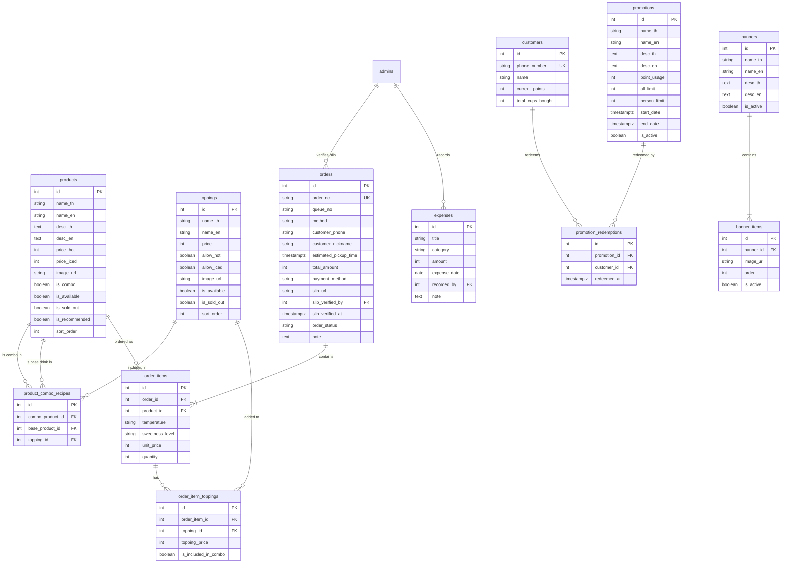

# รายละเอียดความต้องการระบบ (Requirements & Features)

---

## 📌 สรุปภาพรวมหน้าทั้งหมดและสถานะการพัฒนา (Pages & Implementation Status)

### 👤 ฝั่งลูกค้า (Customer / Storefront)
| ลำดับ | หน้า (Route) | คำอธิบาย / ความสามารถ | สถานะ |
| :--- | :--- | :--- | :---: |
| 1 | `/` (Landing Page) | หน้าหลักร้านค้า, แบนเนอร์สไลด์, รายการเมนู, ตะกร้าสินค้า, เช็คแต้มสะสม | ⏳ In Progress |
| 2 | `/order` | หน้ารถเข็น & กรอกข้อมูลสั่งซื้อ เลือกเวลา และชำระเงิน | ⏳ In Progress |
| 3 | `/payment/[uuid]` | หน้าแสดง QR Code พร้อมเพย์ และอัปโหลดสลิปหลักฐานโอนเงิน | ⏳ Pending |
| 4 | `/queue` | หน้าติดตามสถานะคิวคำสั่งซื้อ Real-time | ⏳ In Progress |
| 5 | `/promotion` | หน้ารายละเอียดโปรโมชั่นและสิทธิพิเศษ | ⏳ Pending |
| 6 | `/about-us` | หน้าเกี่ยวกับร้านและช่องทางติดต่อ | ⏳ Pending |

---

### 🛠️ ฝั่งผู้ดูแลระบบ (Admin Portal - `/admin`)
| ลำดับ | หมวดหมู่ | หน้า (Route) | คำอธิบาย / ความสามารถ | สถานะ |
| :--- | :--- | :--- | :--- | :---: |
| 1 | Auth | `/admin/login` | หน้าล็อกอินผู้ดูแลระบบ (JWT Token) | ✅ เสร็จแล้ว |
| 2 | Management | `/admin/management/administrator` | **จัดการแอดมิน**: เพิ่ม/แก้ไข/ลบ, ตั้ง Superadmin, เปิด/ปิดสถานะ | ✅ **เสร็จแล้ว** |
| 3 | Management | `/admin/management/menu` | **จัดการเมนู**: เพิ่ม/แก้ไข/ลบ, อัปโหลด+Cropรูป 1:1, สลับลำดับ (Drag & Drop / Reorder), ราคาร้อน/เย็น, แนะนำ, ซ่อน, ขายหมด, **สูตรคอมโบ (`product_combo_recipes`)** เลือกเครื่องดื่มเบส + ท็อปปิ้งในเซ็ต, Pagination 5 รายการ/หน้า | ✅ **เสร็จแล้ว** |
| 4 | Management | `/admin/management/toppings` | **จัดการท็อปปิ้ง**: เพิ่ม/แก้ไข/ลบ, อัปโหลด+Cropรูป 1:1, สลับลำดับ (Reorder), เลือกร้อน/เย็น, ซ่อน, ขายหมด, Pagination 6 รายการ/หน้า | ✅ **เสร็จแล้ว** |
| 5 | Management | `/admin/management/dashboard` | แดชบอร์ดสรุปยอดขาย รายรับ-รายจ่าย กราฟแนวโน้ม และสถิติ | ⏳ Pending |
| 6 | Management | `/admin/management/slip-check` | ระบบตรวจสอบสลิปและอนุมัติออเดอร์ออนไลน์ | ⏳ Pending |
| 7 | Management | `/admin/management/banner` | จัดการชุดแบนเนอร์และภาพประชาสัมพันธ์หน้าแรก | ⏳ Pending |
| 8 | Management | `/admin/management/promotion` | จัดการโปรโมชั่นและเงื่อนไขการใช้แต้มสะสม | ⏳ Pending |
| 9 | Management | `/admin/management/customer` | ดูรายชื่อสมาชิก ประวัติแต้มสะสม และการแลกสิทธิ์ | ⏳ Pending |
| 10 | POS | `/admin/pos/front-desk` | หน้าจอขายหน้าร้าน (POS Walk-in) คิดเงิน ออกคิว AXX | ⏳ Pending |
| 11 | POS | `/admin/pos/kitchen` | หน้าจอบาร์น้ำ/ห้องครัว (Kitchen Display) จัดการสถานะคิว | ⏳ Pending |

---

## 1. ลูกค้า (Customer / Storefront)

### 1.1 หน้าหลัก (Landing Page)
- **Top Navbar:**
  - โลโก้ / ชื่อร้าน
  - หน้าหลัก
  - เมนู (มี Dropdown / Sub-menu หมวดหมู่สินค้า หรือกดแล้ว Smooth Scroll ไปยังหมวดนั้น)
  - โปรโมชั่น & สิทธิพิเศษ
  - ตรวจสอบสถานะคิว / ติดตามออเดอร์
- **ส่วนบนสุด (Top Banner & Hero Section):**
  - **Banner Carousel / Slider:** ดึงข้อมูลรูปภาพและสไลด์จากระบบแบนเนอร์ (`banners`, `banner_items`) ที่เปิดใช้งานอยู่
  - ข้อความต้อนรับ และปุ่ม Call-to-Action "สั่งเครื่องดื่มเลย!" (Smooth Scroll ไปยังหมวดหมู่เมนู)
- **ส่วนรายการเมนู (Menu Section):**
  - การ์ดสินค้า (`products`):
    - รูปภาพสินค้า, ชื่อเมนู, รายละเอียด, ราคาเริ่มต้น
    - ป้ายกำกับ **"เมนูแนะนำ" (Recommended)** สำหรับสินค้าที่ตั้ง `is_recommended = true`
    - แสดงสถานะ **"สินค้าหมด" (Out of stock)** เมื่อ `is_available = false`
    - ปุ่ม "เลือกเมนู / สั่งซื้อ" เพื่อเปิด Modal ปรับแต่งแก้ว
  - **Modal ปรับแต่งแก้ว (Customization Modal):**
    - เลือกระดับความหวาน (`sweetness_level` เช่น 0%, 25%, 50%, 100%)
    - เลือกท็อปปิ้ง (`toppings`) ได้หลายรายการ (รองรับการเลือก 0 หรือมากกว่า 1 ท็อปปิ้ง ผ่าน `order_item_toppings`) พร้อมแสดงราคาบวกเพิ่มของแต่ละท็อปปิ้ง และปิดตัวเลือกที่ `is_available = false`
    - ปุ่ม "เพิ่มลงรถเข็น"
- **ส่วนโปรโมชั่น & ระบบสะสมแต้ม (Promotions & Loyalty Section):**
  - แสดงรายการโปรโมชั่นที่เปิดใช้งาน (`promotions` ที่ `is_active = true` และอยู่ในช่วง `start_date` - `end_date`)
  - ช่องสำหรับกรอก **เบอร์โทรศัพท์** เพื่อตรวจสอบแต้มสะสมปัจจุบัน (`customers.current_points`) และดูสิทธิ์โปรโมชั่นที่สามารถแลกได้
- **รถเข็นลอย (Floating Cart Button & Drawer/Overlay):**
  - ปุ่มไอคอนรถเข็นลอยอยู่มุมขวาล่าง พร้อม Badge แสดงจำนวนแก้วรวม
  - เมื่อกดจะเปิด Cart Drawer แสดงรายการแก้วที่เลือก (เมนู, ความหวาน, ท็อปปิ้งที่เลือก, ราคารวม)
  - จัดเก็บสถานะตะกร้าสินค้าไว้ใน `localStorage` ป้องกันข้อมูลหายเมื่อ Refresh หน้าเว็บ

### 1.2 ระบบการสั่งซื้อออนไลน์และชำระเงิน (Online Order & Checkout Flow)
- **ข้อมูลผู้สั่งซื้อ:**
  - กรอก **เบอร์โทรศัพท์** (`customer_phone`) และ **ชื่อเล่น** (`customer_nickname`)
  - เลือกระบุ **เวลาที่จะมารับสินค้าโดยประมาณ** (`estimated_pickup_time`)
  - ระบุหมายเหตุเพิ่มเติม (`note` เช่น แยกน้ำแข็ง, ฝากวางไว้ที่โต๊ะ)
- **การใช้แต้มแลกโปรโมชั่น (Promotion Redemption):**
  - หากเบอร์โทรศัพท์มีแต้มเพียงพอและยังไม่เกินโควตาสิทธิ์ (`all_limit`, `person_limit`) ลูกค้าสามารถเลือกกดใช้โปรโมชั่นเพื่อรับส่วนลด/เครื่องดื่มฟรีได้ (บันทึกลง `promotion_redemptions`)
- **การชำระเงิน (PromptPay QR Code & Slip Upload):**
  - ระบบคำนวณยอดเงินรวมสุทธิ แล้วสร้าง **PromptPay QR Code** (Dynamic QR ตามยอดเงินจริง)
  - ผู้ใช้สแกนชำระเงินผ่าน Mobile Banking
  - ผู้ใช้ **แนบรูปสลิปหลักฐานการโอนเงิน** (`slip_url`) เพื่อส่งคำสั่งซื้อเข้าระบบ
- **การออกคิวและติดตามสถานะ (Queue & Live Tracking):**
  - เมื่อส่งออเดอร์เรียบร้อย ระบบจะสร้างรหัสคำสั่งซื้อ (`order_no`) และหมายเลขคิว (`queue_no`)
  - บันทึกสถานะเริ่มต้นเป็น `new_order`
  - หน้าติดตามสถานะออเดอร์แบบ Real-time แสดง Timeline สถานะ:
    1. **รอตรวจสอบสลิป / รับออเดอร์ (`new_order`)**
    2. **กำลังเตรียมเครื่องดื่ม (`preparing`)**
    3. **เครื่องดื่มพร้อมรับแล้ว (`ready`)** (มีแจ้งเตือน Pop-up / เสียงเตือน ให้มารับที่เคาน์เตอร์)
    4. **รับสินค้าเรียบร้อย (`completed`)**

---

## 2. ผู้ดูแลระบบ (Admin Portal - `/admin`)

### 2.1 การเข้าถึงและความปลอดภัย (Authentication)
- ล็อกอินด้วย **Username / Password** สำหรับผู้ดูแลระบบ (`admins`)
- ระบบ Session / JWT และการบันทึก Admin ผู้ปฏิบัติงานในการอนุมัติสลิปและบันทึกค่าใช้จ่าย

### 2.2 ระบบจัดการเมนูสินค้า (Product Management)
- **จัดการสินค้า (`products`):**
  - เพิ่ม/แก้ไข ชื่อ, รายละเอียด, ราคา, อัปโหลดรูปภาพ (`image_url`)
  - สวิตช์เปิด/ปิด: สินค้าพร้อมขาย (`is_available`), สินค้าแนะนำ (`is_recommended`)
  - จัดเรียงลำดับการแสดงผล (`sort_order`)
- **จัดการท็อปปิ้ง (`toppings`):**
  - เพิ่ม/แก้ไข ชื่อท็อปปิ้ง, ราคาบวกเพิ่มต่อช็อต (`price`)
  - สวิตช์เปิด/ปิด สถานะพร้อมขาย (`is_available`), จัดเรียงลำดับ (`sort_order`)

### 2.3 ระบบจัดการแบนเนอร์ประชาสัมพันธ์ (Banner Management)
- จัดการชุดแบนเนอร์ (`banners`): ตั้งชื่อแคมเปญ, เปิด/ปิดการแสดงผล (`is_active`)
- จัดการรูปภาพในแบนเนอร์ (`banner_items`): อัปโหลดรูปภาพ (`image_url`), กำหนดลำดับก่อน-หลัง (`order`), เปิด/ปิดรูปภาพ

### 2.4 ระบบโปรโมชั่นและสมาชิก (Promotions & Loyalty Management)
- **จัดการโปรโมชั่น (`promotions`):**
  - กำหนดชื่อโปรโมชั่น, รายละเอียด, จำนวนแต้มที่ต้องใช้ (`point_usage`)
  - กำหนดโควตารวมทั้งหมด (`all_limit`) และจำกัดสิทธิ์ต่อคน (`person_limit`)
  - กำหนดช่วงเวลาเริ่มต้น-สิ้นสุด (`start_date` - `end_date`), เปิด/ปิดโปรโมชั่น (`is_active`)
- **ดูข้อมูลสมาชิกและประวัติการแลกสิทธิ์:**
  - ดูรายชื่อลูกค้า (`customers`): เบอร์โทรศัพท์, แต้มสะสม (`current_points`), จำนวนแก้วสะสม (`total_cups_bought`)
  - ตรวจสอบประวัติการแลกโปรโมชั่น (`promotion_redemptions`)

### 2.5 ระบบจัดการออเดอร์และการเงิน (Orders & POS Walk-in)
- **ระบบออกรหัสออเดอร์และหมายเลขคิว (`order_no` / `queue_no`):**
  - รันลำดับเลขใหม่ในแต่ละวัน แยกตามช่องทางคำสั่งซื้อ (Prefix):
    - **`A` (หน้าร้าน / Walk-in):** เช่น `A01`, `A02`, `A03`... สำหรับลูกค้าที่มาสั่งซื้อและรอรับที่หน้าร้าน
    - **`B` (ออนไลน์ / Online Pre-order):** เช่น `B01`, `B02`, `B03`... สำหรับลูกค้าที่สั่งจองล่วงหน้าผ่านเว็บ
    - **`C` (ร้านค้า / Partner):** เช่น `C01`, `C02`, `C03`... สำหรับออเดอร์จากร้านค้าพาร์ทเนอร์/ตัวแทนจำหน่าย
- **ระบบขายหน้าร้าน (POS Walk-in):**
  - หน้าจอแตะเลือกเมนู ปรับระดับความหวาน และเลือกท็อปปิ้งได้รวดเร็ว
  - ช่องทางชำระเงิน:
    - **เงินสด (`cash`):** ใส่จำนวนเงินที่รับ คำนวณเงินทอนอัตโนมัติ
    - **พร้อมเพย์ (`promptpay`):** แสดง QR Code ให้ลูกค้าสแกนจ่าย และแนบรูปสลิป
  - ช่องกรอกเบอร์โทรลูกค้า (ไม่บังคับ / Optional) สำหรับสะสมแต้ม/ใช้แต้มแลกสิทธิ์
  - สร้างออเดอร์พร้อมระบุ `method = 'walkin'` และออกหมายเลขคิว `AXX` ทันที
- **ระบบตรวจสอบสลิปและอนุมัติออเดอร์ (Slip Verification):**
  - แสดงรายการออเดอร์ที่แนบสลิปเข้ามา ตรวจสอบรูปภาพสลิป ยอดเงิน วันเวลา
  - ปุ่มกด **"อนุมัติสลิป / ยืนยันยอดเงิน"** -> บันทึก `slip_verified_by` และ `slip_verified_at` พร้อมปรับสถานะออเดอร์เป็น `preparing`
  - ปุ่มกด **"ปฏิเสธ / ยกเลิกออเดอร์"** (`order_status = 'cancelled'`) พร้อมระบุเหตุผล

### 2.6 ระบบจัดการคิวและหน้าจอหลังบาร์ (Kitchen Display / Queue Board)
- จัดการคิวตามลำดับ: แยกแท็บคิว Walk-in (`AXX` - ทำทันที), Online (`BXX` - จัดลำดับตาม `estimated_pickup_time`), และ Partner (`CXX`)
- ปุ่มปรับสถานะคิวแบบ One-Click:
  - `preparing` (กำลังทำ) -> `ready` (พร้อมรับ) -> `completed` (รับของแล้ว)
- หน้าจอแสดงคิวหน้าร้าน (Customer Queue Board Screen) สำหรับเปิดบนจอทีวี แสดงคิวที่กำลังทำและคิวที่พร้อมรับ แยกกลุ่มชัดเจน

### 2.7 ระบบบันทึกรายจ่าย (Expense Management)
- บันทึกค่าใช้จ่ายประจำวันของร้าน (`expenses`):
  - รายการค่าใช้จ่าย (`title` เช่น น้ำแข็ง, วัตถุดิบถั่วเหลือง, แก้ว/หลอด, ค่าแรง)
  - หมวดหมู่ (`category` เช่น วัตถุดิบ, บรรจุภัณฑ์, อุปกรณ์, ค่าแรง)
  - จำนวนเงิน (`amount`), วันที่เกิดรายจ่าย (`expense_date`), บันทึกเพิ่มเติม (`note`)
  - บันทึกชื่อ Admin ผู้ทำรายการอัตโนมัติ (`recorded_by`)

### 2.8 แดชบอร์ดสรุปยอดขายและผลประกอบการ (Sales & Financial Dashboard)
- **ตัวชี้วัดสำคัญ (Key Financial Metrics):**
  - รายรับรวม (Total Revenue) คำนวณจากยอดขายออเดอร์ที่สำเร็จ
  - รายจ่ายรวม (Total Expenses) คำนวณจากตาราง `expenses`
  - กำไรสุทธิ (Net Profit = รายรับ - รายจ่าย)
  - จำนวนออเดอร์ทั้งหมด และจำนวนแก้วรวม (Total Cups)
- **การวิเคราะห์ยอดขาย:**
  - สรุปเปรียบเทียบยอดขาย Online vs Walk-in
  - อันดับเมนูขายดีประจำวัน / ขายดีตลอดกาล (Top Selling Products)
  - สรุปแนวโน้มยอดขายและกำไรแยกรายวัน/รายช่วงเวลา

---

## 3. สถาปัตยกรรมฐานข้อมูล (Database Architecture: PostgreSQL - Pure Relational)

> **เลือกใช้ PostgreSQL เป็นฐานข้อมูลหลัก (Pure Relational Tables):**
> - โครงสร้างตารางแยกความสัมพันธ์ชัดเจน (1NF-3NF Normalized Tables)
> - รองรับความสัมพันธ์แบบ 1-to-Many สำหรับ Toppings ต่อแก้ว (`order_item_toppings`) และ Banner Images (`banner_items`)
> - บันทึกและคำนวณรายรับ-รายจ่าย (Orders & Expenses) แม่นยำตามหลัก ACID
> - รองรับการออกคิว และการจัดอันดับยอดขาย/วิเคราะห์ข้อมูล Dashboard ได้อย่างมีประสิทธิภาพ

---

### 3.1 โครงสร้างตารางใน PostgreSQL (Relational & JSONB)

#### 1. `admins` (ข้อมูลผู้ดูแลระบบ) ✅
| Column | Type | Attributes | Description |
| :--- | :--- | :--- | :--- |
| `id` | SERIAL | PRIMARY KEY | รหัส Admin |
| `uuid` | VARCHAR(36) | UNIQUE, NOT NULL | รหัส UUID สำหรับ Admin |
| `username` | VARCHAR(50) | UNIQUE, NOT NULL | ชื่อผู้ใช้สำหรับล็อกอิน |
| `password_hash` | VARCHAR(255) | NOT NULL | รหัสผ่านที่ผ่านการ Hash (Bcrypt) |
| `name` | VARCHAR(100) | NOT NULL | ชื่อ-นามสกุล/ชื่อเรียก |
| `is_activate` | BOOLEAN | DEFAULT FALSE | สถานะการเปิดใช้บัญชี |
| `is_superadmin` | BOOLEAN | DEFAULT FALSE | สถานะการเปิดใช้บัญชี |
| `created_at` | TIMESTAMPTZ | DEFAULT NOW() | วันที่สร้าง |
| `updated_at` | TIMESTAMPTZ | DEFAULT NOW() | วันที่แก้ไขล่าสุด |

#### 2. `products` (รายการสินค้า - ทั้งเมนูปกติและเซ็ตคอมโบ)
| Column | Type | Attributes | Description |
| :--- | :--- | :--- | :--- |
| `id` | SERIAL | PRIMARY KEY | รหัสสินค้า |
| `name_th` | VARCHAR(150) | NOT NULL | ชื่อสินค้าภาษาไทย (เช่น น้ำเต้าหู้มัทฉะ, Matcha Lover Combo) |
| `name_en` | VARCHAR(150) | NOT NULL | ชื่อสินค้าภาษาอังกฤษ (เช่น Matcha Soy Milk, Combo Matcha Lover) |
| `desc_th` | TEXT | NULL | รายละเอียดสินค้าภาษาไทย |
| `desc_en` | TEXT | NULL | รายละเอียดสินค้าภาษาอังกฤษ |
| `price_hot` | INT | NULL | ราคาร้อน (บาท) |
| `price_iced` | INT | NULL | ราคาเย็น (บาท) |
| `image_url` | VARCHAR(255) | NULL | รูปภาพสินค้า |
| `is_combo` | BOOLEAN | DEFAULT FALSE | เป็นเมนูเซ็ตคอมโบที่มีสูตรเฉพาะหรือไม่ |
| `is_available` | BOOLEAN | DEFAULT TRUE | สถานะพร้อมขาย (เปิด/ซ่อน) |
| `is_sold_out` | BOOLEAN | DEFAULT FALSE | สถานะขายหมด |
| `is_recommended` | BOOLEAN | DEFAULT FALSE | สินค้าแนะนำ |
| `sort_order` | INT | DEFAULT 0 | ลำดับการแสดงผล |
| `created_at` | TIMESTAMPTZ | DEFAULT NOW() | วันที่สร้าง |
| `updated_at` | TIMESTAMPTZ | DEFAULT NOW() | วันที่แก้ไขล่าสุด |

#### 3. `product_combo_recipes` (สูตรประกอบของเมนูเซ็ตคอมโบ)
| Column | Type | Attributes | Description |
| :--- | :--- | :--- | :--- |
| `id` | SERIAL | PRIMARY KEY | รหัสสูตรคอมโบ |
| `combo_product_id` | INT | REFERENCES `products(id)` ON DELETE CASCADE | รหัสเมนูคอมโบหลัก (FK) |
| `base_product_id` | INT | REFERENCES `products(id)` | รหัสเครื่องดื่มรสชาติต้นทางที่เป็นเบส (FK เช่น น้ำเต้าหู้มัทฉะ) |
| `topping_id` | INT | REFERENCES `toppings(id)` | รหัสท็อปปิ้งที่ล็อกมาในเซ็ตคอมโบ (FK เช่น ไข่มุก, ถั่วแดง) |
| `created_at` | TIMESTAMPTZ | DEFAULT NOW() | วันที่สร้าง |

#### 4. `toppings` (รายการท็อปปิ้งเสริม)
| Column | Type | Attributes | Description |
| :--- | :--- | :--- | :--- |
| `id` | SERIAL | PRIMARY KEY | รหัสท็อปปิ้ง |
| `name_th` | VARCHAR(100) | NOT NULL | ชื่อท็อปปิ้งภาษาไทย (เช่น ไข่มุก, เฉาก๊วย) |
| `name_en` | VARCHAR(100) | NOT NULL | ชื่อท็อปปิ้งภาษาอังกฤษ (เช่น Boba, Grass Jelly) |
| `price` | INT | NOT NULL DEFAULT 0 | ราคาบวกเพิ่มต่อช็อต (บาท) |
| `allow_hot` | BOOLEAN | NOT NULL DEFAULT TRUE | อนุญาตให้ใส่ในเครื่องดื่มร้อน |
| `allow_iced` | BOOLEAN | NOT NULL DEFAULT TRUE | อนุญาตให้ใส่ในเครื่องดื่มเย็น |
| `image_url` | VARCHAR(255) | NULL | รูปภาพท็อปปิ้ง |
| `is_available` | BOOLEAN | NOT NULL DEFAULT TRUE | สถานะพร้อมขาย (เปิด/ซ่อน) |
| `is_sold_out` | BOOLEAN | NOT NULL DEFAULT FALSE | สถานะขายหมด |
| `sort_order` | INT | NOT NULL DEFAULT 0 | ลำดับการแสดงผล |
| `created_at` | TIMESTAMPTZ | DEFAULT NOW() | วันที่สร้าง |
| `updated_at` | TIMESTAMPTZ | DEFAULT NOW() | วันที่แก้ไขล่าสุด |

#### 5. `orders` (ออเดอร์คำสั่งซื้อหลัก)
| Column | Type | Attributes | Description |
| :--- | :--- | :--- | :--- |
| `id` | SERIAL | PRIMARY KEY | รหัสออเดอร์ |
| `order_no` | VARCHAR(30) | UNIQUE, NOT NULL; INDEX | รหัสคำสั่งซื้อ/หมายเลขคิว รันเลขใหม่ในแต่ละวัน (ขึ้นต้นตามประเภท: `A` = หน้าร้าน/Walk-in เช่น `A001`, `B` = ออนไลน์/Online เช่น `B001`, `C` = ร้านค้า/Partner เช่น `C001`) |
| `queue_no` | VARCHAR(10) | NOT NULL; INDEX | หมายเลขคิวแสดงบนหน้าจอ (เช่น `A001`, `B001`, `C001`) รันเลขใหม่แยกตามหมวดทุกวัน |
| `method` | VARCHAR(20) | NOT NULL | ช่องทาง: `walkin` (A), `online` (B), `partner` (C) |
| `customer_phone` | VARCHAR(20) | NULL | เบอร์โทรศัพท์ลูกค้า |
| `customer_nickname`| VARCHAR(100) | NULL | ชื่อเล่นลูกค้า |
| `estimated_pickup_time` | TIMESTAMPTZ | NULL | เวลาที่ลูกค้าระบุว่าจะมารับ (สำหรับ online) |
| `total_amount` | INT | NOT NULL DEFAULT 0 | ยอดเงินรวมสุทธิของออเดอร์ (บาท) |
| `payment_method` | VARCHAR(20) | NOT NULL | ช่องทางชำระเงิน: `promptpay` / `cash` |
| `slip_url` | VARCHAR(255) | NULL | ลิงก์รูปสลิปที่แนบมา |
| `slip_verified_by` | INT | NULL REFERENCES `admins(id)` | รหัส Admin ที่กดยืนยันสลิป |
| `slip_verified_at` | TIMESTAMPTZ | NULL | วันเวลาที่ยืนยันสลิป |
| `order_status` | VARCHAR(20) | NOT NULL; INDEX | สถานะคิว: `new_order`, `preparing`, `ready`, `completed`, `cancelled` |
| `note` | TEXT | NULL | หมายเหตุเพิ่มเติม |
| `created_at` | TIMESTAMPTZ | DEFAULT NOW() | เวลาสั่งซื้อ |
| `updated_at` | TIMESTAMPTZ | DEFAULT NOW() | เวลาอัปเดตล่าสุด |

#### 6. `order_items` (รายการแก้วในออเดอร์)
| Column | Type | Attributes | Description |
| :--- | :--- | :--- | :--- |
| `id` | SERIAL | PRIMARY KEY | รหัสไอเทมแก้ว |
| `order_id` | INT | REFERENCES `orders(id)` ON DELETE CASCADE | รหัสออเดอร์หลัก (FK) |
| `product_id` | INT | REFERENCES `products(id)` | รหัสสินค้า/เมนูปกติ หรือ เมนูคอมโบ (FK) |
| `temperature` | VARCHAR(10) | NOT NULL DEFAULT 'iced' | ประเภท: `iced` / `hot` |
| `sweetness_level` | VARCHAR(50) | NOT NULL DEFAULT '100%' | ระดับความหวาน: `0%`, `25%`, `50%`, `75%`, `100%` |
| `unit_price` | INT | NOT NULL | ราคาของแก้วนี้ ณ เวลาที่สั่งซื้อ (บาท) |
| `quantity` | INT | NOT NULL DEFAULT 1 | จำนวนแก้ว |

#### 7. `order_item_toppings` (รายการท็อปปิ้งที่ใส่ในแก้ว)
| Column | Type | Attributes | Description |
| :--- | :--- | :--- | :--- |
| `id` | SERIAL | PRIMARY KEY | รหัสรายการท็อปปิ้งในแก้ว |
| `order_item_id` | INT | REFERENCES `order_items(id)` ON DELETE CASCADE | รหัสแก้วในออเดอร์ (FK) |
| `topping_id` | INT | REFERENCES `toppings(id)` | รหัสท็อปปิ้ง (FK) |
| `topping_price` | INT | NOT NULL DEFAULT 0 | ราคาบวกเพิ่มต่อช็อต ณ เวลาที่สั่ง (0 บาทถ้าเป็น Fixed Topping ในคอมโบ) |
| `is_included_in_combo` | BOOLEAN | DEFAULT FALSE | ท็อปปิ้งนี้ล็อกมาในเซ็ตคอมโบ หรือสั่งเพิ่มพิเศษ |

#### 8. `expenses` (บันทึกรายจ่ายเท่านั้น)
| Column | Type | Attributes | Description |
| :--- | :--- | :--- | :--- |
| `id` | SERIAL | PRIMARY KEY | รหัสรายจ่าย |
| `title` | VARCHAR(200) | NOT NULL | รายการค่าใช้จ่าย (เช่น ค่าน้ำแข็ง, ค่าแก้ว, ค่าถั่วเหลือง) |
| `category` | VARCHAR(100) | NOT NULL | หมวดหมู่ (เช่น วัตถุดิบ, บรรจุภัณฑ์, ค่าแรง) |
| `amount` | INT | NOT NULL | จำนวนเงิน (บาท) |
| `expense_date` | DATE | NOT NULL; INDEX | วันที่เกิดรายจ่าย |
| `recorded_by` | INT | REFERENCES `admins(id)` | Admin ผู้บันทึก |
| `note` | TEXT | NULL | หมายเหตุเพิ่มเติม |
| `created_at` | TIMESTAMPTZ | DEFAULT NOW() | วันที่สร้าง |

#### 9. `customers` (ข้อมูลสมาชิก/สะสมแต้ม)
| Column | Type | Attributes | Description |
| :--- | :--- | :--- | :--- |
| `id` | SERIAL | PRIMARY KEY | รหัสสมาชิก |
| `phone_number` | VARCHAR(20) | UNIQUE, NOT NULL | เบอร์โทรศัพท์ |
| `name` | VARCHAR(100) | NULL | ชื่อ/ชื่อเล่น |
| `current_points` | INT | DEFAULT 0 | แต้มสะสมปัจจุบัน |
| `total_cups_bought` | INT | DEFAULT 0 | จำนวนแก้วที่เคยสั่งซื้อทั้งหมด |
| `created_at` | TIMESTAMPTZ | DEFAULT NOW() | วันที่สมัคร |
| `latest_bought_at` | TIMESTAMPTZ | DEFAULT NOW() | วันเวลาที่สั่งซื้อล่าสุด |

#### 10. `promotions` (โปรโมชั่น / การใช้แต้มแลก)
| Column | Type | Attributes | Description |
| :--- | :--- | :--- | :--- |
| `id` | SERIAL | PRIMARY KEY | รหัสโปรโมชั่น |
| `name_th` | VARCHAR(150) | NOT NULL | ชื่อโปรโมชั่นภาษาไทย (เช่น สะสมครบ 5 แต้ม ฟรี 1 แก้ว) |
| `name_en` | VARCHAR(150) | NOT NULL | ชื่อโปรโมชั่นภาษาอังกฤษ (เช่น Collect 5 Points Get 1 Free) |
| `desc_th` | TEXT | NULL | รายละเอียดและเงื่อนไขภาษาไทย |
| `desc_en` | TEXT | NULL | รายละเอียดและเงื่อนไขภาษาอังกฤษ |
| `point_usage` | INT | NOT NULL DEFAULT 0 | จำนวนแต้มที่ต้องใช้แลก |
| `all_limit` | INT | NULL | สิทธิ์การแลกทั้งหมด (โควตารวม) |
| `person_limit` | INT | NULL | สิทธิ์การแลกจำกัดต่อคน |
| `start_date` | TIMESTAMPTZ | NULL | วันเวลาเริ่มต้นโปรโมชั่น |
| `end_date` | TIMESTAMPTZ | NULL | วันเวลาสิ้นสุดโปรโมชั่น |
| `is_active` | BOOLEAN | DEFAULT TRUE | สถานะเปิด/ปิดโปรโมชั่น |
| `created_at` | TIMESTAMPTZ | DEFAULT NOW() | วันที่สร้าง |

#### 11. `promotion_redemptions` (ประวัติการแลกโปรโมชั่น)
| Column | Type | Attributes | Description |
| :--- | :--- | :--- | :--- |
| `id` | SERIAL | PRIMARY KEY | รหัสการแลก |
| `promotion_id` | INT | REFERENCES `promotions(id)` ON DELETE CASCADE | รหัสโปรโมชั่น (FK) |
| `customer_id` | INT | REFERENCES `customers(id)` ON DELETE CASCADE | รหัสลูกค้าสมาชิก (FK) |
| `redeemed_at` | TIMESTAMPTZ | DEFAULT NOW() | วันเวลาที่กดแลกสิทธิ์ |

#### 12. `banners` (กลุ่มแบนเนอร์ประชาสัมพันธ์)
| Column | Type | Attributes | Description |
| :--- | :--- | :--- | :--- |
| `id` | SERIAL | PRIMARY KEY | รหัสแบนเนอร์ |
| `name_th` | VARCHAR(150) | NOT NULL | ชื่อแบนเนอร์ภาษาไทย |
| `name_en` | VARCHAR(150) | NOT NULL | ชื่อแบนเนอร์ภาษาอังกฤษ |
| `desc_th` | TEXT | NULL | รายละเอียดแบนเนอร์ภาษาไทย |
| `desc_en` | TEXT | NULL | รายละเอียดแบนเนอร์ภาษาอังกฤษ |
| `is_active` | BOOLEAN | DEFAULT TRUE | สถานะเปิด/ปิดการแสดงผล |
| `created_at` | TIMESTAMPTZ | DEFAULT NOW() | วันที่สร้าง |

#### 13. `banner_items` (รูปภาพรายการย่อยในแบนเนอร์)
| Column | Type | Attributes | Description |
| :--- | :--- | :--- | :--- |
| `id` | SERIAL | PRIMARY KEY | รหัสไอเทมรูปภาพ |
| `banner_id` | INT | REFERENCES `banners(id)` ON DELETE CASCADE | รหัสแบนเนอร์หลัก (FK) |
| `image_url` | VARCHAR(255) | NOT NULL | ที่อยู่ URL รูปภาพ |
| `order` | INT | DEFAULT 0 | ลำดับการแสดงผล (Sort Order) |
| `is_active` | BOOLEAN | DEFAULT TRUE | สถานะเปิด/ปิดการแสดงผล |
| `created_at` | TIMESTAMPTZ | DEFAULT NOW() | วันที่สร้าง |

---

### 3.2 แผนภาพความสัมพันธ์ฐานข้อมูล (Database Relationship Diagram - ER Diagram)



---

### 3.3 แผนภาพคลาสความสัมพันธ์ (UML Class Diagram)

```mermaid
classDiagram
    direction TB

    class Category {
        +int id [PK]
        +string name_th
        +string name_en
        +bool is_active
    }

    class Product {
        +int id [PK]
        +int category_id [FK]
        +string name_th
        +string name_en
        +string desc_th
        +string desc_en
        +int price_hot
        +int price_iced
        +string image_url
        +bool is_combo
        +bool is_available
        +bool is_sold_out
        +bool is_recommended
        +int sort_order
        +datetime created_at
        +datetime updated_at
    }

    class ProductComboRecipe {
        +int id [PK]
        +int combo_product_id [FK]
        +int base_product_id [FK]
        +int topping_id [FK]
        +datetime created_at
    }

    class Topping {
        +int id [PK]
        +string name_th
        +string name_en
        +int price
        +bool allow_hot
        +bool allow_iced
        +string image_url
        +bool is_available
        +bool is_sold_out
        +int sort_order
        +datetime created_at
        +datetime updated_at
    }

    class Admin {
        +int id [PK]
        +string username [UK]
        +string password_hash
        +string name
        +datetime created_at
        +datetime updated_at
    }

    class Order {
        +int id [PK]
        +string order_no [UK]
        +string queue_no
        +string method
        +string customer_phone
        +string customer_nickname
        +datetime estimated_pickup_time
        +int total_amount
        +string payment_method
        +string slip_url
        +int slip_verified_by [FK]
        +datetime slip_verified_at
        +string order_status
        +string note
        +datetime created_at
        +datetime updated_at
    }

    class OrderItem {
        +int id [PK]
        +int order_id [FK]
        +int product_id [FK]
        +string temperature
        +string sweetness_level
        +int unit_price
        +int quantity
    }

    class OrderItemTopping {
        +int id [PK]
        +int order_item_id [FK]
        +int topping_id [FK]
        +int topping_price
        +bool is_included_in_combo
    }

    class Expense {
        +int id [PK]
        +string title
        +string category
        +int amount
        +date expense_date
        +int recorded_by [FK]
        +string note
        +datetime created_at
    }

    class Customer {
        +int id [PK]
        +string phone_number [UK]
        +string name
        +int current_points
        +int total_cups_bought
        +datetime created_at
    }

    class Promotion {
        +int id [PK]
        +string name_th
        +string name_en
        +string desc_th
        +string desc_en
        +int point_usage
        +int all_limit
        +int person_limit
        +datetime start_date
        +datetime end_date
        +bool is_active
        +datetime created_at
    }

    class PromotionRedemption {
        +int id [PK]
        +int promotion_id [FK]
        +int customer_id [FK]
        +datetime redeemed_at
    }

    class Banner {
        +int id [PK]
        +string name_th
        +string name_en
        +string desc_th
        +string desc_en
        +bool is_active
        +datetime created_at
    }

    class BannerItem {
        +int id [PK]
        +int banner_id [FK]
        +string image_url
        +int order
        +bool is_active
        +datetime created_at
    }

    %% Relationships
    Category "1" --> "0..*" Product : categorizes
    Product "1" --> "0..*" ProductComboRecipe : defines combo recipe
    Product "1" --> "0..*" ProductComboRecipe : serves as base drink
    Topping "1" --> "0..*" ProductComboRecipe : included in recipe

    Order "1" *-- "1..*" OrderItem : contains
    OrderItem "1" *-- "0..*" OrderItemTopping : contains
    Product "1" --> "0..*" OrderItem : ordered as
    Topping "1" --> "0..*" OrderItemTopping : selected topping

    Admin "1" --> "0..*" Order : verifies slip
    Admin "1" --> "0..*" Expense : records

    Customer "1" --> "0..*" PromotionRedemption : redeems
    Promotion "1" --> "0..*" PromotionRedemption : applied in

    Banner "1" *-- "1..*" BannerItem : contains

---

> **Note:** การกรอกเบอร์โทรศัพท์ ลูกค้าสามารถเลือกกรอกเฉพาะเมื่อต้องการสะสมแต้ม/ใช้สิทธิ์โปรโมชั่นได้ หากไม่ต้องการสะสมแต้มก็สามารถข้ามได้ (หน้าร้าน)

> อันนี้คือคิดเพิ่มนนะ ถ้าหลังจากชำระเงินแล้วหน้าร้านจะได้ QR ให้ลูกค้าสแกนจะเป็นรับบัตรคิว สแกนเข้าไปแล้วให้เซฟลง localStorage ได้ของค่อยปิดการ access QR
> ถ้าในกรณีสั่งออนไลน์อาจจะได้หน้าบัตรคิวไปเลย แต่อาจจะต้องมีคนคอยเช็คสลิปอยู่ดี
> กรณีร้านค้าสั่งอาจจะ ให้สั่งออนไลน์หรือมีคนตอบไลน์

> ก็ปริ้นเมนูอยู่ดี แต่เอาระบบมาทำให้สะดวก

> อยากให้ flow แบบนี้
1. สั่งหน้าร้าน -> พนักงานกดในระบบได้ QR มา -> (อาจจะเช็ค)ตรวจสอบการชำระเงิน -> ลูกค้าสแกน QR -> ทำของ -> แจ้งเตือนมารับ
2. สั่งออนไลน์ -> (ควร)ตรวจสอบการชำระเงิน -> ทำของ -> แจ้งเตือนมารับ

อาจมี Delivery

อาจมี Permission จะได้ Navbar ไม่รก (Super Admin, Barista, Front, Online, Account) -> เพิ่มหน้า Queue Manage แบบกดว่าใครพร้อม หรืออะไรยังไง

เพิ่ม popup ตอนกดดูเมนู (ดูรายละเอียด)