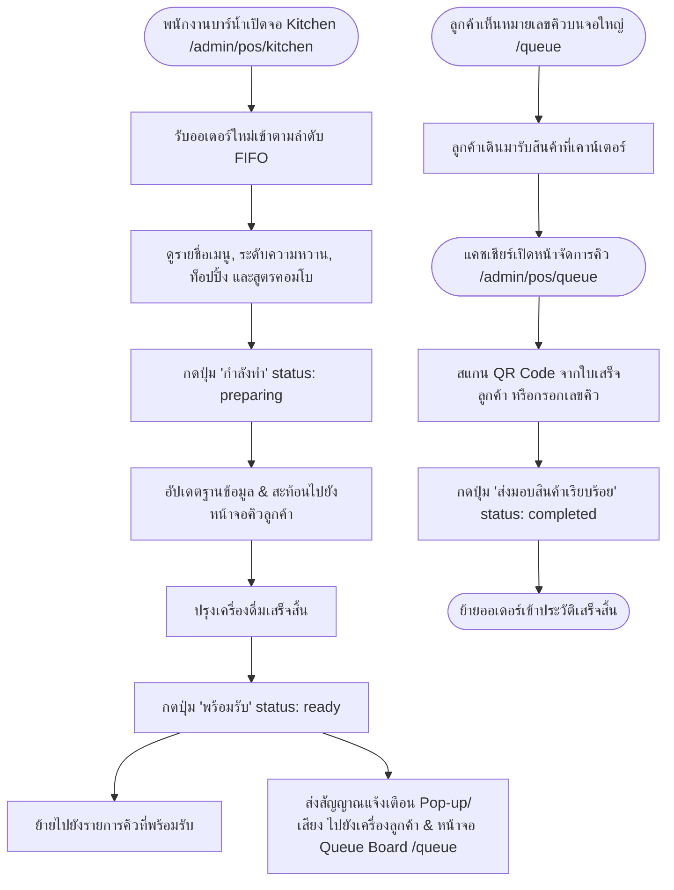
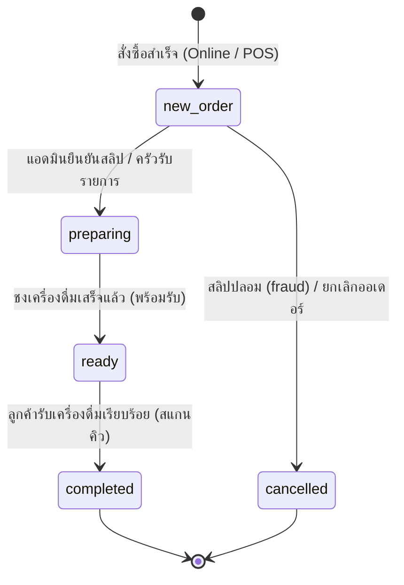

# แผนผังและลำดับขั้นตอนการทำงานของระบบ (System Flow & Workflow Diagram)

เอกสารฉบับนี้อธิบายลำดับการทำงาน (Workflow & User Flow) ของระบบบริหารจัดการร้านค้า **Kaset Fair 70th (ระบบขายเครื่องดื่มน้ำเต้าหู้และ POS)** ทั้งในส่วนผู้ใช้งานลูกค้า (Customer), ระบบขายหน้าร้าน (POS), ผู้ดูแลระบบ (Admin Portal) และการไหลของข้อมูลในระบบหลังบ้าน (Backend Server & Database)

---

## 📌 1. โฟลว์การสั่งซื้อของลูกค้าออนไลน์ (Online Customer Flow)

```mermaid
flowchart TD
    Start([เข้าใช้งานเว็บไซต์ /]) --> SelectMenu[เลือกเมนูเครื่องดื่ม / สินค้าแนะนำ]
    SelectMenu --> OpenModal[เปิด Modal ปรับแต่งแก้ว]
    OpenModal --> Customize[เลือกระดับความหวาน / เลือกท็อปปิ้งเพิ่มเติม]
    Customize --> AddToCart[กด 'เพิ่มลงรถเข็น']
    AddToCart --> ReviewCart{ต้องการสั่งซื้อเพิ่ม?}
    ReviewCart -- ใช่ --> SelectMenu
    ReviewCart -- ไม่ --> GoCheckout[ไปที่หน้ารถเข็น /order]
    
    GoCheckout --> InputInfo[กรอกชื่อเล่น, เบอร์โทรศัพท์ และเวลามารับโดยประมาณ]
    InputInfo --> SelectPayment{เลือกช่องทางชำระเงิน}
    
    SelectPayment -- พร้อมเพย์ QR -- GenerateQR[ระบบสร้าง Dynamic PromptPay QR Code]
    GenerateQR --> PayPromptPay[ลูกค้าสแกนจ่ายผ่าน Mobile Banking]
    PayPromptPay --> UploadSlip[แนบรูปสลิปหลักฐานการโอนเงิน]
    
    SelectPayment -- เงินสด -- CashPolicyCheck{ตรวจสอบ Cash Upload Policy}
    CashPolicyCheck -- immediate --> UploadCashImg[แนบรูปถ่ายเงินสด] --> SubmitOrder
    CashPolicyCheck -- later --> SubmitOrder[ส่งคำสั่งซื้อไปยัง Backend /api/v1/orders]
    UploadSlip --> SubmitOrder
    
    SubmitOrder --> CreateOrder[Backend บันทึก Order & สร้าง UUID + หมายเลขคิว prefix BXX]
    CreateOrder --> RedirectReceipt[เปลี่ยนหน้าไปยัง /order/UUID]
    RedirectReceipt --> PollStatus[Auto-poll สถานะคำสั่งซื้อ Real-time]
    
    PollStatus --> StatusCheck{เช็คสถานะออเดอร์}
    StatusCheck -- new_order --> WaitVerify[รอแอดมินตรวจสอบสลิป] --> PollStatus
    StatusCheck -- preparing --> InKitchen[กำลังปรุงเครื่องดื่มในครัว] --> PollStatus
    StatusCheck -- ready --> NotifyReady[แสดง Pop-up / เสียงเตือน 'เครื่องดื่มพร้อมรับ'] --> PollStatus
    StatusCheck -- completed --> EndCustomer([รับเครื่องดื่มเรียบร้อย])
```

---

## 📌 2. โฟลว์การขายหน้าร้าน POS (POS Walk-in Flow)

```mermaid
flowchart TD
    POSStart([แคชเชียร์เปิดหน้า POS /admin/pos/front-desk]) --> SelectCategory[เลือกหมวดหมู่ / แตะเลือกรายการเครื่องดื่ม]
    SelectCategory --> POSCustomize[เลือกประเภท ร้อน/เย็น, ความหวาน, ท็อปปิ้ง]
    POSCustomize --> POSAddToCart[เพิ่มเข้าตะกร้า POS]
    POSAddToCart --> CheckoutPOS[กดปุ่ม 'ชำระเงิน']
    
    CheckoutPOS --> SelectPOSPayment{เลือกวิธีชำระเงิน}
    
    SelectPOSPayment -- เงินสด -- InputCash[กรอกจำนวนเงินสดที่รับ]
    InputCash --> CalcChange[ระบบคำนวณเงินทอนอัตโนมัติ]
    CalcChange --> CheckCashPolicy{เช็ค cash_upload_mode}
    CheckCashPolicy -- immediate --> POSUploadCash[แคชเชียร์ถ่ายรูป/แนบรูปเงินสด] --> POSSubmit
    CheckCashPolicy -- later --> POSSubmit
    
    SelectPOSPayment -- พร้อมเพย์ QR -- POSGenQR[แสดง PromptPay QR Code บนหน้าจอ]
    POSGenQR --> CustomerScan[ลูกค้าสแกนจ่าย]
    CustomerScan --> CheckSlipPolicy{เช็ค slip_upload_mode}
    CheckSlipPolicy -- immediate --> POSUploadSlip[แคชเชียร์แนบสลิป] --> POSSubmit
    CheckSlipPolicy -- later --> POSSubmit
    
    POSSubmit[ส่งออเดอร์ไปยัง Backend /api/v1/orders] --> POSCreate[Backend สร้างคิว prefix AXX & สถานะ new_order]
    POSCreate --> PrintReceipt[ออกใบเสร็จ / บัตรคิวหน้าร้าน AXX]
    PrintReceipt --> POSEnd([ส่งคิวไปยังห้องครัว Kitchen Display])
```

---

## 📌 3. โฟลว์การตรวจสอบสลิปและการเงิน (Slip Verification & Finance Flow)

```mermaid
flowchart TD
    VerifStart([แอดมินการเงินเปิด /admin/management/slip-check]) --> LoadPending[ดึงรายการออเดอร์ที่แนบสลิป/หลักฐานเงินสด]
    LoadPending --> SelectOrder[คลิกเลือกออเดอร์เพื่อดูรายละเอียด & รูปสลิป]
    SelectOrder --> InspectSlip[ตรวจสอบ ยอดเงิน, เวลา, เลขบัญชี หรือรูปเงินสด]
    
    InspectSlip --> Decision{ตัดสินใจผลการตรวจสอบ}
    
    Decision -- ยืนยันถูกต้อง -- SetVerified[เปลี่ยนสถานะเป็น verified]
    SetVerified --> AutoKitchen[อัปเดตสถานะออเดอร์ไปยังห้องครัว]
    
    Decision -- เนียน / สลิปปลอม -- SetFraud[เลือกสถานะ 'เนียนเลยนะครับ' fraud]
    SetFraud --> InputReason[กรอกเหตุผลข้อสงสัย / หมายเหตุ]
    InputReason --> SaveFraud[บันทึกผล & แจ้งเตือนออเดอร์ผิดปกติ]
    
    Decision -- ตั้งค่าเงื่อนไขการแนบ -- OpenSettings[ปรับเปลี่ยน slip_upload_mode / cash_upload_mode]
    OpenSettings --> SaveSettings[บันทึกลง system_settings Table]
    SaveSettings --> BroadcastPolicy[ผลบังคับใช้ทันทีทั่วทั้งระบบแบบ Real-time]
```

---

## 📌 4. โฟลว์การจัดการห้องครัวและคิว (Kitchen Display & Queue Management Flow)



---

## 📌 5. โฟลว์ระบบจัดการบทบาทและสิทธิ์ (Role & Permissions Flow)

```mermaid
flowchart TD
    RoleStart([Superadmin เปิดหน้าจัดการสิทธิ์ /admin/management/permissions]) --> FetchRoles[ดึงรายการ Roles: superadmin, admin, accounting, cashier, barista]
    FetchRoles --> SelectTargetRole[เลือกบทบาทที่ต้องการแก้ไขสิทธิ์]
    SelectTargetRole --> LoadCurrentPerms[แสดงสิทธิ์ปัจจุบันแยกตามหมวดหมู่]
    
    LoadCurrentPerms --> TogglePerms[คลิกติ๊กเปิด/ปิด Checkbox สิทธิ์ต่างๆ เช่น permission.view, permission.edit]
    TogglePerms --> ClickSave[กดปุ่ม 'บันทึกการเปลี่ยนแปลง']
    ClickSave --> SendAPI[ส่ง PUT /api/v1/roles/:id/permissions]
    SendAPI --> DBUpdate[อัปเดตตาราง permission_role ใน PostgreSQL]
    DBUpdate --> ShowToast[แสดง Toast แจ้งเตือนบันทึกสำเร็จ]
    
    DBUpdate --> MiddlewareCheck[เมื่อ Admin ใช้งานเมนูต่างๆ Auth Middleware จะตรวจสอบสิทธิ์ใน permission_role]
    MiddlewareCheck -- มีสิทธิ์ -- AllowAccess[อนุญาตให้เข้าถึงและใช้งาน]
    MiddlewareCheck -- ไม่มีสิทธิ์ -- DenyAccess[ตอบกลับ 403 Forbidden]
```

---

## 📌 6. สรุปสถานะการไหลข้อมูลของคำสั่งซื้อ (Order Life Cycle States)

